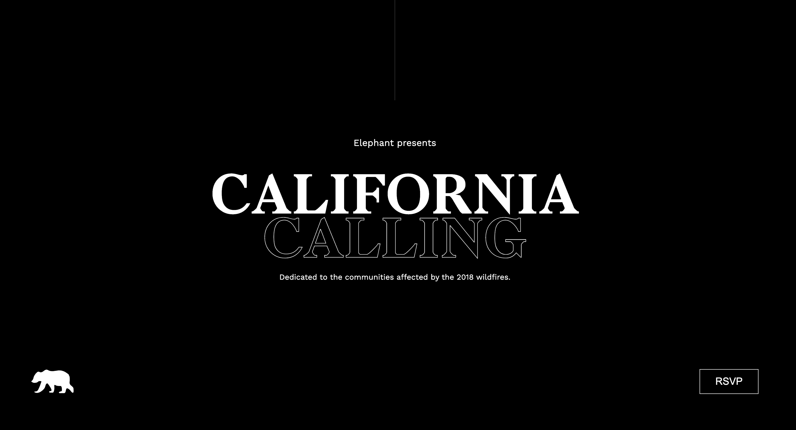

<a href="[https://app.netlify.com/sites/california-calling-by-mags/overview](https://california-calling-by-mags.netlify.app/)
"># California Calling Projekt</a>

## Übersicht
Das "California Calling" Projekt ist ein responsives und modernes Webdesign, das den von den Waldbränden in Kalifornien 2018 betroffenen Gemeinden gewidmet ist. Es kombiniert visuell ansprechendes Design mit semantischem HTML und SCSS, um Skalierbarkeit, Barrierefreiheit und Wartbarkeit sicherzustellen.


## Funktionen
- **Semantisches HTML**: Verwendung von Elementen wie `<header>`, `<main>`, `<section>` und `<footer>` für verbesserte Zugänglichkeit und SEO.
- **CSS-Einheiten für Responsivität**: Das Projekt vermeidet Media Queries und nutzt stattdessen relative Einheiten wie `rem`, `vh` und `vw`, um Responsivität sicherzustellen.
- **SCSS-Integration**:
  - Modulare Struktur mit Partials für Schriften, Mixins und Variablen.
  - Variablen für konsistente Typografie und Farbgestaltung.
  - Mixins zur Vereinfachung von wiederholten Stilen.
- **Modernes Design**: Ein sauberes und minimalistisches Konzept mit:
  - Dunklen und hellen Themen.
  - Benutzerdefinierten Animationen für dynamische visuelle Effekte.
  - Grid- und Flexbox-Layouts.
- **Animationen**:
  - Keyframes für rotierende Elemente (z. B. der Ring in der "Poppy Bear" Sektion).
  - Sanfte Übergänge bei interaktiven Elementen wie Buttons.
- **Barrierefreiheit**: Berücksichtigung von Textkontrasten, Alt-Attributen für Bilder und skalierbaren Schriftgrößen.

## Projektstruktur
```plaintext
assets/
├── css/
├── fonts/
├── img/
├── scss/
    ├── _fonts.scss
    ├── _mixin.scss
    ├── _variables.scss
    └── main.scss
.gitignore
README.md
index.html
```
- **CSS/SCSS**: Hauptstyles werden aus modularen SCSS-Partials kompiliert, um die Wartung zu erleichtern.
- **Schriften**: Benutzerdefinierte Schriften, definiert in `_fonts.scss`.
- **Bilder**: Organisiert für einfacheren Zugriff und optimiert für das Web.

## Wichtige Komponenten
### Header
- Beinhaltet eine Navigationsleiste, ein Logo und einführende Inhalte.
- Hervorgehobener Titel mit einem hohlen Effekt durch `-webkit-text-stroke`.



### Intro-Sektion
- Text und Statistiken mit markanter Typografie.
- Ein Bild einer Karte, das mit relativer Positionierung modern gestaltet ist.

### Bildergalerie
- Ein Grid-Layout zur Darstellung von Bildern und Texten.
- Interaktive Übergänge und Animationen, um die Benutzererfahrung zu verbessern.

### Golden Bear & Poppy Bear Sektionen
- Hervorgehobene Features mit Künstlerbeschreibungen.
- Einzigartige Designs für jedes Bärenkonzept mit dunklen und hellen Kontrasten.
- Rotierende Ringanimation in der "Poppy Bear" Sektion.

### Footer
- Dynamische Banneranimation mit wechselnden Farben.
- Social-Media-Icons und Partnerlogos.


## Browserkompatibilität
Das Projekt ist mit modernen Browsern kompatibel und nutzt progressive Verbesserungen sowie Fallback-Stile, um die Nutzbarkeit zu erhalten.

## Erste Schritte
1. Repository klonen:
   ```bash
   git clone <repository-url>
   ```
2. In das Projektverzeichnis wechseln:
   ```bash
   cd california-calling
   ```
3. Abhängigkeiten installieren:
   ```bash
   npm install
   ```
4. SCSS in CSS kompilieren:
   ```bash
   npm run build:css
   ```
5. `index.html` in einem Browser öffnen, um das Projekt anzuzeigen.
